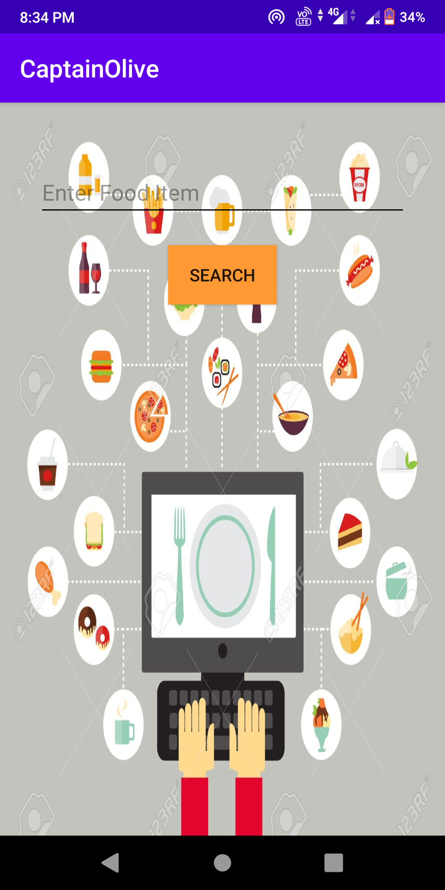

# Captain-Olive

Captain Olive is an Android App which will provide you the recipe of any type of dish/food. From the Api the data is being fetched using Retrofit and the User is getting the  food items recipe/Instructions to make a particular  food item which the user is trying to search.  

# Screenshots

# Libraries this app uses
###### Retrofit Libraries - 
                            implementation 'com.squareup.retrofit2:retrofit:2.6.0'
                             implementation 'com.squareup.retrofit2:converter-gson:2.5.0'
                            implementation 'com.squareup.okhttp3:logging-interceptor:3.12.3'

###### Card View - 
                               implementation 'androidx.cardview:cardview:1.0.0'
 ###### Glide -      
                    implementation 'com.github.bumptech.glide:glide:4.11.0'
                     annotationProcessor 'com.github.bumptech.glide:compiler:4.11.0'
  ###### RecyclerView - 
                         implementation "androidx.recyclerview:recyclerview:1.1.0"
   
  

# Permissions
###### Full Network Access
